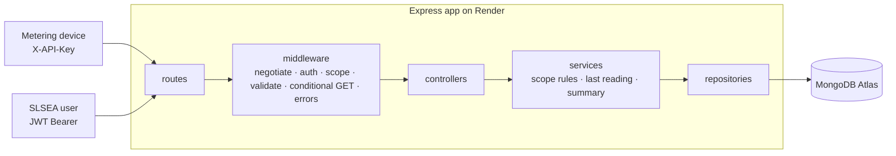

# PLAN.md — NB6007CEM Coursework 1 (SLSEA Solar Generation API)

> **Status:** Phase 0 (planning) done. **No application code yet.** Updated 2026-09-19 (rev 9: branches `dev_hashini` → `dev`, plus a kept-but-undeployed `qa` branch; `main` never used; one deployment, Dev, from `dev`; 13 diagrams).
> **Truth order:** brief PDF → module white paper (REST API Design Guidelines, WSO2-based) → lecture notes S1–S8 → this file. A higher source always wins over this file.
> **Attempt status `[YOU]`:** fresh submission — no earlier submission and no marker feedback exist. Brief §14 ("make good the original submission") therefore does not apply; nothing to remediate. Treat the brief, white paper and lectures as the only sources.

**Tags**

| Tag | Meaning |
|---|---|
| `[BRIEF §n]` | Stated in the coursework brief |
| `[LEC Sn]` | Stated in lecture notes/slides of session n (white paper cited second-hand) |
| `[YOU]` | Your own fixed decision |
| `[PROPOSAL]` | My suggestion. Becomes `[YOU]` only when you confirm it in `docs/design/my-decisions.md` |
| `[WP §n]` | Stated in the white paper (WSO2 REST API Design Guidelines) — now read directly |
| `[UNCONFIRMED]` | Rule I still cannot see (rubric bands, lecturer's S9–S15 choices). Do not treat as fact |

---

## 0. What I could and could not read

| Source | Status |
|---|---|
| Brief (9 pp) | Read in full |
| Marking rubric | **Current rubric not available.** Brief §11 weights are authoritative. `outdated_use_as_a_ref.pdf` was read: it is for module NIB304CEM, batch 24.1P, with different weights, so it is **supplementary only** (see §17). Not authoritative for marks, criteria, wording or requirements |
| White paper | **Read in full** (uploaded 2026-09-19). Sections cited below as `[WP §n]` |
| Lectures S1, S2, S5–S8 | Read (project files) |
| Lectures S3, S4 | Read from lecturer repo `dev`; **missing from project files** |
| Lectures S9–S15 | **Not available anywhere** (lecturer repo stops at Day 4). The white paper now covers the rules; only the lecturer's own interpretation is missing |
| Lecturer repo `dev` | Lecture material only. No code, no white paper |
| Reference 3: `gimnakatugampala/WebAPIDev-Test`, branch `dev/05-07-2026` | Early snapshot (taxi domain, ~Day 3): in-memory seed, no auth, no tests, Azure deploy, Express 5. **Learn from / avoid, not copy:** base path `/v1/api/` (not WP §5.4 form) and a **global `/pings` collection** (the trap in `[LEC S3/S4]`). Its `project.md` is a planning-doc example only. Later branches (`12-07-2026-dev`) add auth; not reviewed |
| Reference 2: `PruthuviDe/WebAPIDev_Test` (classmate repo) | Taught system (police vehicles), MongoDB + JWT. No Swagger, no tests, error body is `{error}` only. Its README describes S9–S10 — **second-hand, unverified** |
| Your repo `hashiniRanasinghe/solar-api` | **Not inspected** (not reachable from my side) |

Remaining gaps: rubric bands, S3/S4 files, S9–S15 (OQ-01). Where a lecture note and the white paper disagree, the white paper is the design authority (brief cover) — see §4a.

---

## 1. Goal and gates

| Hard gate `[BRIEF §12]` | Done? |
|---|---|
| Public HTTPS API on Render, seeded, operational at submission time | [ ] |
| Live OpenAPI/Swagger from the deployment (`/docs`) | [ ] |
| Repo shared with module leader as collaborator; incremental commits | [ ] |
| Report 2250–2750 words with the six required sections | [ ] |
| Signed declaration + AI-disclosure appendix (prompts, AI-aids) | [ ] |
| Viva: any artefact I cannot explain forfeits its marks | [ ] |

Report prose is **my own**. Turnitin similarity < 15% and AI score < 15% are screening thresholds, not allowances (cover, declaration, bibliography excluded) `[BRIEF announcement sheet]`.

---

## 2. Requirements checklist (from the brief)

| ID | Requirement | Source | Rubric area | Done |
|---|---|---|---|---|
| G1 | Public HTTPS URL, populated with seed data, operational at submission | §7.1, §12, §13 | Deployment | [ ] |
| G2 | Live OpenAPI (Swagger) surface served from the deployment | §7.2 | Deployment / API design | [ ] |
| G3 | Git repo shared with module leader; incremental commit history | §7.3, §12, §13 | Deployment | [ ] |
| G4 | Report 2250–2750 words, 6 identifiable sections (see §11) | §8, §12 | Report | [ ] |
| G5 | Signed declaration + AI-disclosure appendix | §7.4, §10 | Gate | [ ] |
| G6 | Viva attended; every artefact explainable | §9, §10 | Gate | [ ] |
| G7 | Backend only; JSON for all resources | §5, §13 | API design | [ ] |
| M1 | Entities: Province, District, GridSubstation, SolarInstallation, GenerationReading, User; 1-to-many chain | §3 | Architecture | [ ] |
| M2 | `meter_id`/`inverter_id` is an installation attribute. **No Device entity** | §3 | Architecture | [ ] |
| M3 | Readings are an append-only time series, not `last_power` on installation | §3 | Architecture | [ ] |
| M4 | Reading has ≥ installation, timestamp, instantaneous power (kW), **cumulative** energy (kWh), voltage; extra fields justified | §3 | Architecture | [ ] |
| M5 | Seed: 9 provinces, 25 districts, ≥20 substations, ≥200 installations, ≥1 week readings per installation, FK-consistent | §4 | Functionality | [ ] |
| M6 | Data model documented before resources/URIs | App. A (§3) | Architecture | [ ] |
| A1 | Collection + atomic: provinces, districts, substations, installations; scoped where child only makes sense under parent | §5 | API design | [ ] |
| A2 | Installation **composite** (installation + most relevant related data) | §5 | API design | [ ] |
| A3 | **Last-known-reading** per installation, as a derived resource | §5, §6 | API design | [ ] |
| A4 | **Readings sub-collection** under each installation (plus jurisdiction-scoped readings under substation/district/province, OQ-04) | §5, §6 | API design | [ ] |
| A5 | URI naming/scoping (§5.1, §5.6), JSON (§6), headers Location/ETag/Last-Modified/Content-Type (§8), codes 200/201/400/404/406/412 (§9) | App. A | API design | [ ] |
| A6 | Ingestion: correct method, 201, `Location` | §5 | API design | [ ] |
| A7 | Correct CRUD + idempotency on writable resources. **DECIDED (OQ-03):** readings = create only (device); installations = POST/PUT/DELETE (admin); hierarchy, users, derived resources read-only | §5 | API design | [ ] |
| A8 | **Stretch:** district generation summary (derived, aggregate: current total power, today's total energy) | §5, §6 | Coverage (upper band) | [ ] |
| V1 | Pagination: total count + next/previous links | §5 | Coverage | [ ] |
| V2 | Filtering: jurisdiction (province/district/substation) and time window. **DECIDED (OQ-04):** readings collections under installation, substation, district and province (jurisdiction in the path) with `from`/`to`; `/installations` also filters by `province_id`/`district_id`/`substation_id` | §5, §6 | Coverage | [ ] |
| V3 | Sorting by timestamp asc/desc | §5 | Coverage | [ ] |
| V4 | Conditional GET → 304, empty body | §5, App. A (§10.4) | Coverage | [ ] |
| V5 | One consistent error schema: integer `code`, `message`, `description`/`error[]` detail, `moreInfo` | §5, App. A; `[WP §11]` | Coverage | [ ] |
| S1 | Device authenticates as its installation; writes only that installation's readings, nothing else | §2, §5 | Security | [ ] |
| S2 | Read scope by jurisdiction (national/provincial/district); district user cannot read another district | §2, §5 | Security | [ ] |
| S3 | Users never write readings | §2 | Security | [ ] |
| S4 | 401 vs 403 used correctly; `WWW-Authenticate` on 401 | `[LEC S7, S8]` | Security | [ ] |
| R1–R6 | Report sections: Architecture & data model · API design justification · Security · Deployment · Richardson evaluation (incl. why not L3) · Critical evaluation | §8 | Report | [ ] |

**Rubric weights (verified against brief §11):** API design 20 · Architecture 15 · Coverage 15 · Security 15 · Implementation with generated code 10 · Deployment 10 · Report 10 · Functionality 5 = 100. "Coverage" means design-spine breadth and advanced behaviour (V1–V5), **not test coverage**. Band descriptors are in a separate rubric; the previous-batch copy you will upload is indicative only.

**Correction to old plan:** Conditional GET (V4) is a *listed requirement*, not an optional top-band extra. Only A8 is labelled upper-band stretch `[BRIEF §5]`.

---

## 3. Fixed facts

| Fact | Tag |
|---|---|
| Richardson Level 2 (L3 out of scope) | `[YOU]` `[BRIEF cover]` |
| Hierarchy Province → District → Substation → Installation → Reading | `[YOU]` `[BRIEF §3]` |
| No Device entity; `meter_id` is an installation attribute | `[YOU]` `[BRIEF §3]` |
| Readings append-only: no PUT/PATCH/DELETE on readings | `[YOU]` `[LEC S7]` |
| Devices write only their own installation (`X-API-Key`) | `[YOU]` `[BRIEF §2]` |
| Users read by jurisdiction (JWT Bearer) | `[YOU]` (JWT is your choice; brief only requires jurisdiction-scoped auth) |
| JSON field names snake_case | `[YOU]` `[LEC S5]` |
| URI path segments: lowercase, hyphens, no underscores/camelCase, plural collections, singular atomic | `[WP §5.1]` |
| Readings only as a scoped collection; **no global `/readings`**, no `/devices` | `[WP §4.6, §5.6]` |
| Data model before URLs | `[YOU]` `[BRIEF App. A]` |
| Stack: Node ≥ 18, Express, MongoDB Atlas, Render (`process.env.PORT`), Swagger/OpenAPI | `[YOU]` |
| **Writable:** readings (POST, device only) and installations (POST/PUT/DELETE, admin only). **Read-only:** hierarchy, users, derived resources | `[YOU]` (OQ-03) |
| **Readings by jurisdiction:** path-scoped collections under `/substations/{id}`, `/districts/{id}`, `/provinces/{id}` (GET only) plus under installations; jurisdiction in the path, time window/sort/pagination in the query | `[YOU]` (OQ-04) |
| Noun sub-resources for derived resources (`last-reading`, `generation-summary`); the words "processing function" never appear in a URI | `[YOU]` (OQ-21) |
| Hierarchy top-level with query filters; `/substations`; string IDs (`INS-0001`), Mongo `_id` hidden; Mongoose | `[YOU]` (OQ-05, 06, 07, 19) |
| Seed: 9 / 25 / **40 substations / 240 installations**, 15-minute readings for 7 days (≈161,000); derived `district_id`/`province_id` stored read-only, proven by a seed integrity check | `[YOU]` |
| **Branches:** `dev_hashini` (my working branch), `dev` (central), `qa` (**kept as a best-practice marker, never deployed**). **`main` is never touched.** **One deployment: Dev, from `dev`** (this is the URL that gets submitted) | `[YOU]` |
| Deadline **Sun 4 Oct 2026** | `[YOU]` (OQ-17) |
| `energy_kwh` is a **cumulative** running total (not per interval) | `[BRIEF §3]` confirmed by you |
| Hierarchy is **derived from `substation_id`**: `district_id`/`province_id` are server-derived, read-only, never client-supplied | `[YOU]` |
| Seed contains **recent/current readings** so every endpoint shows working data | `[YOU]` |
| **No timestamp tolerance / future-time rule** (no evidence in brief or reference material) | `[YOU]` |
| Base path `/solar/v1.0` (feature-code `solar`, version `v1.0`); `/`, `/docs`, `/docs.json` outside it | `[YOU]` `[WP §5.4–5.5]` (OQ-22) |
| `POST /login` for token issue (processing function, verb name, 200 + token) | `[YOU]` `[WP §5.1, §7.3]` (OQ-11) |
| Sort syntax `sort=(timestamp DESC)` / `sort=(a ASC, b DESC)` | `[YOU]` `[WP §10.2]` (OQ-23) |
| Processing functions (`last-reading`, `generation-summary`) use the **lecturer's noun sub-resource form**; deviation from WP §5.1 is recorded and defended in the critical evaluation | `[YOU]` `[LEC S5/S6]` (OQ-21) |
| Missing or invalid/unknown API key → 401; valid key used on another installation → 403 | `[YOU]` `[WP §9]` (OQ-10) |
| Stricter than brief: no `localhost` in spec/report/docs | `[YOU]` (README dev notes may say it; keep it out of the spec and report) |

---

## 4. Defaults checked against the white paper

| Item | Status | Detail |
|---|---|---|
| Pagination | **Confirmed** `[WP §10.3]` | Query `offset` + `limit`; response carries `count` (total), `next`, `previous`. Envelope shape is "application specific", so the `data` key is **my choice** `[PROPOSAL]` |
| Sort syntax | **Changed** `[WP §10.2]` | WP examples: `sort=(price ASC, delivery-date DESC)` and `sortAsc=price`. **`-field` is not in the WP** (old default dropped) → OQ-23 |
| Filter | **Confirmed** `[WP §10.2, §7.1]` | Query string on the collection, attribute=value (`?status=on-stock`). Projection is optional; **not planned** (brief doesn't ask) |
| Query-param names | Open | WP mixes styles (`delivery-date`, `sortAsc`). Not settled → OQ-20 |
| Error body | **Changed** `[WP §11]` | `code` is an **integer** (required), `message` (required), `description`, `moreInfo` (URL preferred), `error[]` list for per-field errors. Old default `{code, message, moreInfo}` with a string code was wrong |
| DELETE | **Confirmed** `[WP §7.4]` | 200 first call, 404 afterwards. **Not 204** |
| 201 response | **Extended** `[WP §7.3, §9]` | `Location` + `ETag` + `Last-Modified` + body; **plus `Content-Location`** when the body repeats the resource |
| 401 vs 403 | **Clarified** `[WP §9]` | 401 = credentials missing **or not accepted**, must carry `WWW-Authenticate`. 403 = understood but refused. Fits: unknown key → 401; valid key for another installation → 403 |
| 406 | **Confirmed** `[WP §10.1]` | Even if only one media type is supported, a different `Accept` must get 406 |
| 415 | **Confirmed** `[WP §9]` | |
| Conditional GET | **Confirmed** `[WP §10.4]` | `If-None-Match` takes precedence over `If-Modified-Since`; unchanged → 304, empty body |
| Concurrency | **Confirmed** `[WP §10.5]` | `If-Match` (precedence) / `If-Unmodified-Since` on PUT; stale → 412 |
| PUT / PATCH | **Confirmed** `[WP §7.2, §4.5]` | PUT is whole-document, never partial; partial updates go through processing-function resources, not PATCH |
| Base path + version | **New** `[WP §5.4, §5.5]` | `/{feature-code}/v{major}.{minor}/…`, e.g. `/solar/v1.0/installations` → OQ-22 |
| Processing-function naming | **Conflict — decided `[YOU]`: lecture form** `[WP §5.1]` vs `[LEC S5/S6]` | WP: verb names, not sub-resources of individual resources, individual as parameter. Lecture: noun sub-resource `/vehicles/{id}/last-position` → OQ-21 |
| Bearer + scopes | **Confirmed** `[WP §12.2]` | `Authorization: Bearer`; token carries **scopes**; insufficient scope → request fails. Basic only over HTTPS `[WP §12.1]` |
| Richardson level | **Note** `[WP §1]` | §1 says guidelines reach "Level 1", yet lists resources, methods, headers and status codes (Level 2) and §2 says "Level 2". Internal inconsistency; cite carefully. L3 not reached: hypermedia, no established best practice |

### 4a. Where lecture notes and the white paper disagree

| Topic | Lecture says | White paper says | Plan follows |
|---|---|---|---|
| Processing-function URI | noun, sub-resource (`/vehicles/{id}/last-position`) `[LEC S5/S6]` | verb, top-level, not under an individual resource `[WP §5.1]` | **Decided `[YOU]`:** lecture form, deviation recorded (OQ-21) |
| Verbs in URIs | only controllers may use verbs `[LEC S5]` | processing functions **and** controllers `[WP §5.1]` | WP |
| Wrong key on a device | 401 in S7 example, 403 in S8 | 401 = not accepted; 403 = understood but refused `[WP §9]` | Unknown key 401, other installation's key 403 |
| Error body | `{error: "…"}` then `code, message, moreInfo` `[LEC S8]` | integer `code`, `message`, `description`, `moreInfo`, `error[]` `[WP §11]` | WP |
| Envelope | none until S9 `[LEC S5]` | count/next/previous required, shape app-specific `[WP §10.3]` | WP + brief |

---

## 5. Technology / stack decision

| Area | Choice | Tag | Note |
|---|---|---|---|
| Runtime | Node (current LTS locally; `engines: >=18`) | `[YOU]` | Brief sets no version |
| Framework | Express | `[YOU]` | Express 5 forwards rejected async handlers to the error middleware; Express 4 does not |
| Database | MongoDB Atlas (free M0) | `[YOU]` | Persistence needed because POST readings must survive restarts (in-memory `seed.json` from the lectures would not) |
| DB access | Mongoose | `[YOU]` (OQ-19) | Schemas self-document; native driver rejected |
| Read auth | JWT Bearer (`jsonwebtoken`), passwords with `bcryptjs` | `[YOU]` / `[PROPOSAL]` for libs | Lectures teach Basic then OAuth bearer (S13 missing) |
| Device auth | `X-API-Key`, stored as SHA-256 hash, timing-safe compare | `[YOU]` header / `[PROPOSAL]` hashing | Random high-entropy keys don't need bcrypt |
| Docs | `swagger-ui-express` + `yaml`, spec in `docs/design/openapi.yaml` | `[YOU]` Swagger / `[PROPOSAL]` libs | |
| Hosting | **One** Render free Web Service, **`solar-api-dev`**, tracking branch `dev`, auto-deploy on every push. This is the submitted URL | `[YOU]` | Free services sleep when idle (first hit can take ~30 s `[LEC S2]`) |
| Tests | Node built-in `node --test` + global `fetch` against `BASE_URL` | `[PROPOSAL]` | Zero extra deps; same suite runs against the live URL |
| Dev reload | `node --watch` | `[PROPOSAL]` | No nodemon |
| **Not used** | TypeScript, Docker, GraphQL, Redis, rate-limit libs, GitHub Actions | `[PROPOSAL]` | Render auto-deploy is enough |

**Dependency set:** `express dotenv cors mongoose jsonwebtoken bcryptjs swagger-ui-express yaml`. No dev dependencies.

---

## 6. Architecture



```text
src/
  app.js  server.js            server binds process.env.PORT
  config/    env.js  db.js
  routes/  controllers/  services/  repositories/  models/
  middleware/ negotiate.js authJwt.js authApiKey.js scope.js validate.js conditional.js errorHandler.js
  utils/     pagination.js  sort.js  links.js  etag.js  errors.js
scripts/     seed.js
test/        *.test.js
docs/design/ my-decisions.md  data-model.md  openapi.yaml  architecture.md
```

One line per layer: routes wire URI + method to middleware and controller · controllers translate HTTP to a service call and back · services hold rules (scope, last reading, summary) · repositories are the only code that talks to MongoDB · middleware handles cross-cutting concerns. Controllers stay thin. Layers = `[PROPOSAL]` (same as old playbook C3).

---

## 7. API / endpoint plan

Resource map `[PROPOSAL]` unless tagged. Names follow `[WP §5.1]`. All paths are relative to the base path `/solar/v1.0` `[YOU]`; `/`, `/docs`, `/docs.json` stay outside it. Path variables: `{province-id}`, `{district-id}`, `{substation-id}`, `{installation-id}`, `{reading-id}`.

| # | Method + URI | Resource type `[LEC S3/S5]` | Auth | Success | Errors |
|---|---|---|---|---|---|
| 1 | `GET /` | health | none | 200 | — |
| 2 | `GET /docs`, `GET /docs.json` | docs | none | 200 | — |
| 3 | `POST /login` `[YOU]` | **processing function**, verb name allowed `[WP §5.1, §7.3]` | credentials | 200 + token | 400, 401 |
| 4 | `GET /provinces`, `/provinces/{province-id}` | collection, atomic | JWT | 200 / 304 | 401, 403, 404 |
| 5 | `GET /districts`, `/districts/{district-id}` (`?province_id=`) | collection, atomic | JWT | 200 / 304 | 400, 401, 403, 404 |
| 6 | `GET /substations`, `/substations/{substation-id}` (`?district_id=`, `?province_id=`) `[YOU]` | collection, atomic | JWT | 200 / 304 | 400, 401, 403, 404 |
| 7 | `GET /installations` (`?province_id=`, `?district_id=`, `?substation_id=`, `sort`, `offset`, `limit`) `[YOU]` | collection | JWT | 200 / 304 | 400, 401, 403 |
| 8 | `GET /installations/{installation-id}` | **composite**: installation + `last_reading` (`null` if none) | JWT | 200 / 304 | 401, 403, 404 |
| 9 | `GET /installations/{installation-id}/last-reading` `[YOU]` | **processing function**; lecture form, deviates from WP §5.1 (recorded) | JWT | 200 / 304 | 401, 403, 404 (none yet) |
| 10 | `GET /installations/{installation-id}/readings` | **scoped collection**: `from`, `to`, `sort`, `offset`, `limit` | JWT | 200 / 304 | 400, 401, 403, 404 |
| 10a | `GET /substations/{substation-id}/readings` `[YOU]` | **scoped collection** (OQ-04), same query as #10 | JWT | 200 / 304 | 400, 401, 403, 404 |
| 10b | `GET /districts/{district-id}/readings` `[YOU]` | **scoped collection** (OQ-04), same query | JWT | 200 / 304 | 400, 401, 403, 404 |
| 10c | `GET /provinces/{province-id}/readings` `[YOU]` | **scoped collection** (OQ-04), same query | JWT | 200 / 304 | 400, 401, 403, 404 |
| 11 | `GET /installations/{installation-id}/readings/{reading-id}` | atomic, target of `Location` `[LEC S8]` | JWT | 200 / 304 | 401, 403, 404 |
| 12 | `POST /installations/{installation-id}/readings` | ingestion (collection = factory `[WP §7.3]`) | **X-API-Key** | **201** + `Location`, `Content-Location`, `ETag`, `Last-Modified`, body | 400, 401, 403, 409, 415 (**404 OPEN, OQ-26**) |
| 13 | `POST /installations` `[YOU]` | create (collection = factory `[WP §7.3]`) | JWT admin (`solar:write`) | 201 + `Location` + headers | 400, 401, 403, 409, 415 |
| 14 | `PUT /installations/{installation-id}` `[YOU]` | whole-document replace `[WP §7.2]` | JWT admin | 200 | 400, 401, 403, 404, 412, 415 |
| 15 | `DELETE /installations/{installation-id}` `[YOU]` (readings kept, OQ-13 proposal) | delete | JWT admin | 200 | 401, 403, 404 (2nd call) |
| 16 | `GET /districts/{district-id}/generation-summary` `[YOU]` | **processing**, stretch A8; lecture form, deviates from WP §5.1 | JWT | 200 / 304 | 401, 403, 404 |

**Same query on every readings collection** (`from`, `to`, `sort=(timestamp DESC)`, `offset`, `limit`); ties broken by `installation_id` so pages are stable `[PROPOSAL]`. Placement rule `[YOU]` (OQ-04): *path = which parent; query = how to read it*. Rejected: `GET /readings?district_id=` (phantom global collection), filters only on `/installations` (would not filter readings), copying jurisdiction ids onto every reading.

**Deliberately absent (defend at viva):** global `/readings` · `/devices` · PUT/PATCH/DELETE on readings · any PATCH `[LEC S8]` · writes on province/district/substation `[LEC S7]` · `/users` endpoints (users are seeded).

**Global behaviour** `[PROPOSAL]` unless noted: `res.json()` everywhere (`Content-Type: application/json`) `[LEC S5]` · `Accept` mismatch → 406 even with one media type `[WP §10.1]` · wrong request `Content-Type` → 415 `[WP §9]` · bad input → 400 with per-field `error[]` (422 not used) `[WP §11]` · `If-None-Match` (precedence) then `If-Modified-Since` → 304 empty body `[WP §10.4]` · `If-Match` (precedence) on PUT → 412; `If-Modified…` variants optional `[WP §10.5]` · every 401 carries `WWW-Authenticate`; API-key scheme name is custom (`ApiKey realm="solar"`) `[PROPOSAL]` · error body per §4 table `[WP §11]`, integer codes = HTTP status × 100 + n (e.g. 40001) `[PROPOSAL]` · unsupported method on a known path → 405 + `Allow` · collection always 200 (empty = `[]`/`data: []`), member 404 `[LEC S8]` · installation/reading write timestamps in UTC ISO 8601 `Z`.

**Composite vs last-reading:** composite serves "installation + latest state in one call"; `last-reading` serves reading-only clients. Same helper feeds both (no duplicated logic) `[LEC S6]`.

---

## 8. Database plan (MongoDB Atlas)

Fields snake_case, public IDs are string business IDs (`PV-01`, `DT-03`, `SS-001`, `INS-0001`, `RD-…`); Mongo `_id` is never exposed `[YOU]` (OQ-07). Mongoose `[YOU]` (OQ-19).

| Collection | Key fields | Indexes |
|---|---|---|
| `provinces` | `province_id`, `name` | unique `province_id` |
| `districts` | `district_id`, `name`, `province_id` | unique `district_id`; `province_id` |
| `substations` | `substation_id`, `name`, `district_id`, `province_id` (derived from district) | unique `substation_id`; `district_id` |
| `installations` | `installation_id`, `meter_id`, `name`, `substation_id`, `district_id` (derived), `province_id` (derived), `capacity_kw`, `api_key_hash` (never returned), `created_at`, `updated_at` | unique `installation_id`; unique `meter_id`; unique `api_key_hash`; `substation_id`; `district_id` |
| `generation_readings` | `reading_id`, `installation_id`, `timestamp`, `power_kw`, `energy_kwh`, `voltage`, `received_at` | unique `(installation_id, timestamp)`; `(installation_id, timestamp desc)` for history + last reading |
| `users` | `user_id`, `username`, `password_hash`, `role`, `jurisdiction_level`, `jurisdiction_id` | unique `username` |

- **Derived ids `[YOU]`:** `substation_id` is the source of truth; `district_id` and `province_id` are derived by the server (never accepted from the client; a PUT copied from a GET is ignored and recomputed). **Storage `[YOU]`:** stored read-only copies for one-lookup scope checks and filters, proven consistent by a seed integrity test; alternative is joining on every request.
- **Readings carry no jurisdiction ids** `[YOU]` (OQ-04): for a jurisdiction route the service finds the installation ids under the path parent (derived ids on installations, indexed) and queries `generation_readings` for those ids. History therefore follows an installation if its substation changes. Sort is `(requested field, installation_id)`; at seed scale the largest result is one province's readings.
- Device key lives **on the installation** (`api_key_hash`, unique index), not in a device collection — consistent with M2. Lookup by hash: no match → 401; match on another installation → 403 `[PROPOSAL]`.
- Unique `(installation_id, timestamp)` makes device retries safe (duplicate → 409) — answers "idempotency" for the ingest path `[PROPOSAL]` OQ-09.
- `capacity_kw` gives a realistic ceiling for seed and validation. Extra fields need one-line justification in the report `[BRIEF §3]`.

**Seed (`scripts/seed.js`)** — minimum `[BRIEF §4]`: 9 provinces, 25 districts, ≥20 substations, ≥200 installations, ≥1 week of readings each. Chosen size `[YOU]`: 40 substations, 240 installations, 15-minute interval × 7 days ≈ 161,000 readings (fits Atlas M0 512 MB). Idempotent, deterministic RNG, batch `insertMany`. Half-sine diurnal curve 06:00–18:00 Asia/Colombo, stored UTC; `energy_kwh` cumulative and non-decreasing in the seed. **Freshness `[YOU]` (requirement) / mechanism `[PROPOSAL]`:** window ends at run time; `seed:top-up` appends readings from each installation's newest reading to "now" (safe to re-run via the unique installation+timestamp rule); run both before submission and before the viva; README states "data as of". No background generator on Render. Night-time readings are 0 kW by design, so current total power can legitimately be 0 outside daylight. Also seeds demo users and per-installation device keys (hashes only stored); demo credentials documented (OQ-15).

Old plan's seed (76 installations, ~14,600 readings) is **below brief scale** (§4: 200+ installations) and must be regenerated.

---

## 9. Authentication and security plan

| Concern | Control | Where | Tag |
|---|---|---|---|
| Write/read split | Two schemes, two middleware; JWT never accepted on POST readings; API key never accepted on GET | `authApiKey`, `authJwt` | `[BRIEF §2]` |
| Device = its installation | Key hash looked up by `{installation-id}` from path; `installation_id` never taken from body | `authApiKey` | `[LEC S8]` |
| Missing / not-accepted credential | 401 + `WWW-Authenticate` (unknown key, bad password, expired/invalid JWT) | both | `[WP §9]` |
| Understood but refused | 403 (valid key for another installation; user outside jurisdiction or lacking scope) | `authApiKey`, `scope` | `[WP §9]` `[LEC S8]` OQ-10 |
| Token scopes | JWT carries a `scope` list (e.g. `solar:read`, `solar:write`) plus jurisdiction claims; insufficient scope → 403 | `authJwt` | `[WP §12.2]` `[PROPOSAL]` |
| Honest labelling | Own JWT issued by `/login`, not a full OAuth 2.0 flow — do not call it OAuth without an authorization server | report evidence | `[PROPOSAL]` |
| Roles `[YOU]` (OQ-03) | **Device** (API key): POST own readings only. **Reader** (JWT `solar:read`): GET in jurisdiction. **Admin** (JWT `solar:read`+`solar:write`, national): GET all; POST/PUT/DELETE installations. Reader write attempt → 403; admin posting a reading → 401 (needs a device key) | `authJwt`, `authApiKey` | `[YOU]` |
| Jurisdiction on readings routes `[YOU]` (OQ-04) | Scope check runs on the **path parent**; parent missing → 404 first; province route for a district user → 403 | `scope.js` | `[YOU]` |
| Jurisdiction scope | JWT carries `role`, `jurisdiction_level`, `jurisdiction_id`; `scope` middleware resolves resource → province/district and compares; collections filtered to scope | `scope.js` + services | `[PROPOSAL]` OQ-12 |
| Users never write readings | POST readings route has no JWT path | route table | `[BRIEF §2]` |
| Passwords / keys | bcrypt hash; SHA-256 key hash; secrets never logged or returned | services | `[PROPOSAL]` |
| Secrets | `.env` git-ignored; `.env.example` committed; **no hard-coded fallback secrets** (classmate repo has one — don't repeat) | config | `[PROPOSAL]` |
| Injection | Validate types on every query/body value; reject objects where strings expected (NoSQL operators) | `validate.js` | `[PROPOSAL]` |
| Input limits | `limit` capped; body size limit; range checks on `power_kw`, `voltage`, `energy_kwh` | `validate.js` | `[PROPOSAL]` |
| Transport | HTTPS via Render; JWT short expiry | deploy | `[LEC S7]` |
| Error leakage | Central handler; no stack traces to client | `errorHandler.js` | `[PROPOSAL]` |
| CORS | `cors` enabled; backend-only API | `app.js` | `[PROPOSAL]` |

---

## 10. Testing plan

Brief mandates no automated tests. Tests are for **my confidence, viva evidence and traceability**; keep small.

| Level | What | How |
|---|---|---|
| Contract/behaviour | Status, headers, shapes per endpoint | `node --test test/` with `fetch`; `BASE_URL` env picks local or the live Render URL |
| Seed integrity | Counts, FK integrity, derived `district_id`/`province_id` match their parents, ≥1 week/installation, newest reading is recent after top-up | `test/seed.test.js` via API + one script check |
| Security matrix | 401 vs 403 vs 200 per client type | `test/auth.test.js` (device key, wrong key, user in/out of scope, no creds) |
| Live smoke | Same suite pointed at Render before every submission step | `BASE_URL=https://<app>.onrender.com npm test` |
| Manual evidence | `curl -i` outputs and Swagger screenshots for the report | saved under `docs/evidence/` |

Write-path tests leave data behind (append-only); they use future-unique timestamps so re-runs don't collide.

---

## 11. Documentation plan

| Artefact | Purpose |
|---|---|
| `README.md` | Live URL, `/docs` link, run/seed/test, demo credentials, endpoint table |
| `docs/design/my-decisions.md` | **My hand-written** decisions (viva ammunition) |
| `docs/design/data-model.md` | ER (Mermaid), entities, keys, scoping notes |
| `docs/design/openapi.yaml` | Contract; grown alongside each phase; served at `/docs` |
| `docs/design/diagrams/*.mmd` + `README.md` | 14 Mermaid diagram sources (context, resources, ER, auth, pipeline, flows, deployment, layers, roles, branching); each marks OPEN dependencies |
| `docs/requirements.md`, `docs/rubric-gaps.md` | From this plan, brief and rubric |
| `ai-log.md` | Every prompt (chat + Claude Code); source of the AI-disclosure appendix |
| `docs/evidence/` | Curl transcripts, screenshots |

**Report evidence checklist (evidence only — I write all prose):**

| Section | Evidence to have ready |
|---|---|
| R1 Architecture & data model | ER diagram; entity table; sample installation JSON showing `meter_id` and no `last_*` fields; reading count via API (time series); snake_case, JSON media-type reason; layer diagram |
| R2 API design | Resource map with type (atomic/collection/composite/processing) and trigger; §5.1/§5.6 check per URI; method table (safe/idempotent); `curl -i` for 200/201/304/400/404/406/412; pagination, filter, sort, conditional GET examples; error-schema sample |
| R3 Security | Write-read split diagram; scheme table with reasons; 401/403 matrix transcripts; district-A user denied on district B; key hashing evidence |
| R4 Deployment | Live URL (the submitted environment); Render services + env var names (no values); Atlas databases; `/docs` screenshot; seed counts; **branch/environment diagram (`11`) and PR/merge history**; `git log --oneline --graph`; cold-start note |
| R5 Richardson | Level 0/1/2 evidence per level; where and why it stops short of 3 (no hypermedia controls; pagination links are not HATEOAS); cite WP §1 carefully — it says "Level 1" but describes Level 2 |
| R6 Critical evaluation | Test results; known limits (free-tier cold start, no rate limiting, etc.); "what I'd change" list |
| Outside word count | Signed declaration; AI-disclosure appendix from `ai-log.md`; diagrams, tables, code listings, references `[BRIEF §8]` |

Word count 2250–2750 excludes: declaration, AI appendix, diagrams, tables, code listings, references.

---

## 12. Git, branching and environments

**Branches `[YOU]`** — `main` is **never used**. Do not create, commit to, merge into or delete it. If GitHub shows one, ignore it.

| Branch | Role | Who commits | Deployed? |
|---|---|---|---|
| `dev_hashini` | My working branch: all daily commits happen here (Claude Code works here too, under my review) | Me | No; runs locally against `slsea_dev` |
| `dev` | Central integration branch and the **default branch on GitHub** (what the marker sees). Receives my work only by merge request (a pull request on GitHub). The one direct commit is a **root commit containing just `.gitignore`**, so that a merge request has a base to merge into. Tags live here | Nobody directly, except that root commit | **Yes: Dev environment, automatically on every push** |
| `qa` | Created from `dev` at setup and **kept as a marker of best practice** (a QA stage exists in the process). **Not deployed**, no QA environment, no QA database | Nobody | **No** |

**Flow:** `dev_hashini` → PR → `dev` → Dev environment (automatic). `qa` is left where it is. Optional, not part of the routine and only if you decide so later: fast-forward `dev` into `qa` at phase ends as a "verified" marker.

**Environment `[YOU]`** (OQ-30: one deployment, Dev)

| Env | Branch | Render service | Deploys | Atlas database | Env vars | Purpose |
|---|---|---|---|---|---|---|
| Dev | `dev` | `solar-api-dev` | automatically on every push to `dev` | `slsea_dev` | `MONGODB_URI`, `JWT_SECRET`, `NODE_ENV=production`, `APP_ENV=dev` | Integration checks **and the submitted URL** |

**Stage names `[YOU]`:** `deployment_dev` = the Dev environment and the **only real deployment** (branch `dev`, database `slsea_dev`; the Render service is `solar-api-dev` because a service name becomes part of its URL and URLs cannot contain underscores). `deployment_qa` = the name of the QA stage, **defined but not created**: no service, no database; the `qa` branch is its marker.

Consequence to manage `[PROPOSAL]`: because the submitted URL auto-deploys, every merge to `dev` changes it. So: run the step tests locally **before** the pull request; check the Dev URL right after each merge; after the final check tag `submission` and **stop merging into `dev`** (optionally switch Render's auto-deploy off) until marking and the viva are done.

**Rules `[PROPOSAL]`**

| Step | When | Gate |
|---|---|---|
| `dev_hashini` → `dev` | After each build step (D1, D2, …) | Runs locally, step tests pass, explain-back done, `ai-log.md` updated in the same commit. Merge the PR with **"Create a merge commit"** (no squash) |
| Check Dev | After every merge to `dev` (wait for the Render deploy) | `BASE_URL=<dev url> npm test` |
| Phase end | When the phase exit test in §13 passes on the Dev URL | Tag `pN` on the `dev` tip |
| Broken deploy | — | Fix on `dev_hashini` → `dev`. Never move or delete a pushed tag; tag again (`pNb`) |
| Keep in sync | After each PR merged into `dev` | `git switch dev_hashini && git pull origin dev` |
| Freeze | After the last check | Tag `submission`; merge nothing more into `dev` until marking and the viva are done, or the deployed code and the repo stop matching |

- One database (`slsea_dev`) in the Atlas M0 cluster. The demo credentials in the README belong to this deployment. Re-seed and top-up shortly before submission and before the viva.
- OpenAPI `servers` uses the relative URL `/solar/v1.0`, so the spec never mentions localhost `[PROPOSAL]`.
- `GET /` also returns `environment` (from `APP_ENV`) `[PROPOSAL]`.
- No GitHub Actions: Render's auto-deploy is enough.

**Other rules**

| Rule | Detail |
|---|---|
| History | Small commits, one logical step each. **No squash, no rebase of pushed history, no force-push.** Merge commits keep the incremental history the brief asks for `[BRIEF §7.3, §13]` |
| Format | `type(scope): summary` — `feat`, `fix`, `docs`, `test`, `chore`, `refactor` |
| Tags | `p1`…`p8` and `submission`, on `dev` |
| Protection | If your GitHub plan allows it for a private repo, protect `dev` (pull request required). Otherwise the rule is discipline: never commit directly to it |
| Secrets | `.env`, `node_modules/`, `refs/`, `seed-keys.txt` git-ignored; `.env.example` committed; rotate anything ever committed |
| Reference repos | Cloned into `refs/` only. **Never copy code from the classmate repos** |
| Collaborator | Add lecturer on GitHub: **`nirangadh`** (https://github.com/nirangadh), in Phase 1. Check that the GitHub default branch is `dev` |
| AI log | Append to `ai-log.md` in the same commit as the change |

**Risks to know `[PROPOSAL]`:** a marker who looks for `main` will find nothing, so the default branch must be `dev`; a `qa` branch with no QA deployment may prompt a viva question, and the answer must be yours ("kept as a marker of a QA stage; this assignment deploys one environment"); the submitted URL is the auto-deploying one, hence the freeze rule.

---

## 13. Phased implementation plan

| Phase | Deliverable | Exit test | Playbook | Model |
|---|---|---|---|---|
| **0** | Plan; `my-decisions.md` written by hand; OQ-01…OQ-05 answered | You confirm the plan | B | Coach |
| **0b** | **Design & diagrams:** 14 diagram sources in `docs/design/diagrams/`, decisions relabelled, OQ-03/04/21 closed. No code | You review decisions + diagrams and say GO | C4 | Coach |
| **1** | Walking skeleton: repo structure, Express `GET /`, env config, Atlas connect; branches `dev`, `qa` (kept, undeployed) and `dev_hashini` created (no `main`); the **Dev** service deployed from `dev`; lecturer added | `curl -i` on the Dev URL → 200 over HTTPS with `environment: dev`; tag `p1` on `dev` | A, D1–D3 | Sonnet 5 |
| **2** | `data-model.md`; models; **full-scale seed**; error contract; hierarchy reads (provinces/districts/substations) with envelope + pagination util | Counts match brief; 404 vs empty collection correct | C1, D4–D6 | Sonnet 5 |
| **3** | Installations (composite), `last-reading`, per-installation readings history + by-id (no auth yet); shared "readings under a parent" service written so Phase 6 only adds routes | Composite has `last_reading`; history is path-scoped | D7–D8 | Sonnet 5 |
| **4** | Device write path: `POST readings`, API key auth, 201 + headers, 409 duplicate, 401/403 | Wrong-installation key → 403; `Location` resolves via GET | D9–D10 | Sonnet 5 (auth on Opus 5) |
| **5** | Users, `POST /login`, JWT with scopes, jurisdiction scope on **all** reads | District user denied on other district; national reads all | D11 | **Opus 5** |
| **6** | Query surface: `from`/`to`, sort with tie-break, pagination; **readings under substation, district, province** (OQ-04); catalogue filters on `/installations`, `/districts`, `/substations`; conditional GET everywhere; 406 | 304 with empty body proven with curl; jurisdiction histories page cleanly | D12–D14 | Sonnet 5 |
| **7** | Admin CRUD on installations (roles per OQ-03; PUT + `If-Match` 412, DELETE); district summary (stretch); OpenAPI complete and served at `/docs` | Spec matches real routes | D15–D17 | Sonnet 5 / Opus 5 for spec |
| **8** | Hardening: tests complete, security review, audit vs requirements, re-seed, live smoke, README, tag `submission` | Live suite green | E1–E3 | Opus 5 |
| **9** | Report (I write it) + viva prep. Capture evidence from Phase 4 onward | Word count, Turnitin, mock viva | F, G | Coach only |

### Timeline (OQ-17)

Deadline **Sun 4 Oct 2026** (`[YOU]`, OQ-17; time of day still to be read from the LMS). Today is Sat 19 Sep.

| Dates | Milestone |
|---|---|
| Sat 19 – Sun 20 Sep | Phases 0 and 0b: review decisions and diagrams, resolve blocking OPEN items, say GO |
| Mon 21 Sep | Phase 1: skeleton live on Render + Atlas; lecturer added |
| Tue 22 – Wed 23 Sep | Phase 2: data model, full seed, error contract, hierarchy reads |
| Thu 24 Sep | Phase 3: installations composite, last-reading, history |
| Fri 25 Sep | Phase 4: device write path |
| Sat 26 – Sun 27 Sep | Phase 5: users, JWT, jurisdiction scope |
| Mon 28 Sep | Phase 6: filter, sort, conditional GET, 406 |
| Tue 29 Sep | Phase 7: admin CRUD, Swagger complete, (stretch summary only if ahead) |
| Wed 30 Sep | Phase 8: tests, security review, audit, re-seed, **code freeze + tag** |
| Fri 25 Sep – Thu 1 Oct | Report evidence captured from Phase 4 onward; report drafted in parallel |
| Thu 1 Oct | Report draft complete; contradiction check (F2) |
| Fri 2 Oct | Report final; word count; Turnitin + AI score |
| Sat 3 Oct | Live smoke test, declaration signed, submit (buffer day) |
| Sun 4 Oct | Deadline |

**This is tight: nine phases in ~11 days.** Cut order if behind: (1) A8 district summary (stretch), (1b) `/provinces/{id}/readings` is the last of the OQ-04 routes to be built and the first of them to drop, because all four share one service, (2) Swagger polish, (3) merge Phases 3+4 and 6+7. Never cut: seed at full scale, device auth, jurisdiction scope, 201 + `Location`, pagination, conditional GET, error schema, live deployment, report evidence. Viva date pending (OQ-25).

---

## 14. Requirement → implementation → test traceability

Test IDs are planned, not written yet. `T` = `node --test` case against `BASE_URL`.

| Req | Implementation (planned) | Test |
|---|---|---|
| G1 | Render service; Atlas; `scripts/seed.js` | T01 live `GET /` 200 over HTTPS; T02 collections non-empty |
| G2 | `swagger-ui-express`, `docs/design/openapi.yaml` | T03 `/docs` 200; T04 `/docs.json` parses, lists all paths |
| G3 | Git workflow §12 | Manual: `git log`, collaborator screenshot |
| G4–G6 | Report, declaration, viva | Manual checklist |
| M1–M4 | `models/`, `data-model.md` | T05 installation JSON has `meter_id`, no `last_power`; T06 `GET /devices` → 404; T07 readings carry the required fields; T07b seeded `energy_kwh` is non-decreasing per installation |
| M5 | `scripts/seed.js` | T08 counts (9/25/≥20/≥200); T09 FK integrity **and derived ids match parents**; T10 ≥7 days per installation; T10b newest reading per installation is recent (after top-up) |
| A1 | routes 4–7 | T11 200 + envelope on collections; T12 unknown id → 404; T13 empty result → 200 |
| A2 | route 8 | T14 `last_reading` object, or `null` when none |
| A3 | route 9 | T15 equals newest reading; T16 404 when none |
| A4 | routes 10–11 | T17 history scoped to one installation; T18 `GET /readings` global → 404 |
| A5 | middleware `negotiate`, `errorHandler`, response helpers | T19 `Content-Type` JSON; T20 `Accept: application/xml` → 406; T21 snake_case keys everywhere |
| A6 | route 12 | T22 201 + `Location` + `Content-Location` + `ETag` + `Last-Modified`; T23 `Location` returns 200; T24 duplicate timestamp → 409 |
| A7 | routes 13–15 | T25 PUT whole-doc semantics (derived ids recomputed); T26 stale `If-Match` → 412; T27 second DELETE → 404; T28 PUT/PATCH/DELETE on readings → 405; T28b POST/PUT/DELETE on a province/district/substation → 405; T28c duplicate `meter_id` → 409 |
| A8 | route 16 | T29 total power = sum of newest `power_kw`; today's energy = sum of (newest cumulative − cumulative at local midnight) |
| V1 | `utils/pagination.js` | T30 `count` equals total; `next`/`previous` follow and terminate |
| V2 | routes 7, 10, 10a–c | T31a `/districts/{id}/readings` returns only that district's installations' readings; T31b same for substation and province; T31c `/installations?district_id=` narrows the catalogue; T31d pages of a jurisdiction history neither repeat nor skip rows (tie-break); T32 time window bounds readings; T33 bad date → 400 |
| V3 | `utils/sort.js` | T34 asc and desc by timestamp; T35 unknown sort field → 400 |
| V4 | `middleware/conditional.js` | T36 `If-None-Match` → 304, 0-byte body; T36b `If-Modified-Since` works and `If-None-Match` wins when both sent; T37 changed data → 200 |
| V5 | `utils/errors.js`, `errorHandler.js` | T38 every 4xx has integer `code`, `message`, `description`; T38b validation errors list `error[]` per field |
| S1 | `authApiKey` | T39 no key → 401 + `WWW-Authenticate`; T39b unknown key → 401; T40 other installation's key → 403; T41 key from body ignored |
| S2 | `authJwt`, `scope` | T42a district user: own `/districts/{id}/readings` 200, other district's 403, own province's `/readings` 403; T42 district user reads own district 200; T43 other district 403; T44 national reads all; T45 collections filtered to scope |
| S3 | route table, roles | T46 JWT on POST readings → 401; T46b reader `POST/PUT/DELETE /installations` → 403; T46c device key on `POST /installations` → 401; T46d admin `POST /installations` → 201 |
| S4 | auth middleware | T47 401 has `WWW-Authenticate`; 403 does not |
| R1–R6 | Report | Manual evidence checklist §11 |

---

## 15. Open questions and assumptions

Rows marked DECIDED are closed. Unmarked rows are `[PROPOSAL]` awaiting your yes before the phase shown. **Genuinely OPEN:** OQ-26, 27, 28, 29, validation limits, OQ-25 (viva), current rubric.

| ID | Question | My recommendation | Blocks |
|---|---|---|---|
| OQ-01 | **White paper now in project (resolved).** Still missing: rubric bands, S3/S4 files, S9–S15 | Upload the rest; rubric matters most | report, Phase 8 audit |
| OQ-02 | **DECIDED `[YOU]`:** fresh submission; no previous attempt, no marker feedback | Earlier message said "official re-sit"; read as the module attempt, not a prior submission. Brief §14 not applicable | — |
| OQ-03 | **DECIDED `[YOU]`:** writable = readings (device POST) and installations (admin POST/PUT/DELETE); read-only = hierarchy, users, derived resources; roles device / reader / admin | Risk: brief §2 says users are read-clients; admin writes installations, never readings. Details in `my-decisions.md` §13 | P7 |
| OQ-04 | **DECIDED `[YOU]` (own decision, not confirmed with the lecturer):** readings collections under installation, substation, district and province (GET only above installation); jurisdiction = path parent, time window/sort/pagination = query; `/installations` also filtered by query | Rationale and rejected alternatives in `my-decisions.md` §11. Extends the brief's "sub-collection under each installation" | P6 |
| OQ-05 | **DECIDED `[YOU]`:** hierarchy resources top-level with query filters | Client-need test `[LEC S3]`; readings scoped | P2 |
| OQ-06 | **DECIDED `[YOU]`:** `/substations` | — | P2 |
| OQ-07 | **DECIDED `[YOU]`:** string IDs (`INS-0001`); Mongo `_id` hidden | — | P2 |
| OQ-08 | What "most relevant related data" goes in the composite? | `last_reading` only (parent IDs already present as FKs) `[LEC S5/S6]` | P3 |
| OQ-09 | Reading timestamp: device event time or server time? (`[LEC S8]` accepts either) | Device-supplied, required, plus server `received_at`; unique `(installation_id, timestamp)` → 409 | P4 |
| OQ-10 | **DECIDED `[YOU]`:** missing/invalid API key → 401; valid key on another installation → 403 | Fits WP §9 | P4 |
| OQ-11 | **DECIDED `[YOU]`:** follow white paper → `POST /login`, 200 + token | WP §5.1 verb-named processing function; §7.3 POST initiates functions | P5 |
| OQ-12 | Out-of-scope access: 403 or 404? Silent filtering or 403 for collections? | 403 for atomic/scoped; collections filtered to scope | P5 |
| OQ-13 | Deleting an installation leaves its readings (`[LEC S8]` retains history). Then history is unreachable via API | Follow lecture (retain, installation → 404); explain in report | P7 |
| OQ-14 | **DECIDED `[YOU]`:** 15-minute seed interval (40 substations, 240 installations) | — | P2 |
| OQ-15 | How does the marker authenticate? | Documented demo users + device keys in README/Swagger, flagged demo-only | P5 |
| OQ-16 | **DECIDED:** lecturer = `nirangadh` (https://github.com/nirangadh) | Add as collaborator in Phase 1 | P1 |
| OQ-17 | **DECIDED `[YOU]`:** deadline Sun 4 Oct 2026 (LMS time of day still to note) | Timeline in §13 | — |
| OQ-18 | **DECIDED `[YOU]`:** repo is new and **empty** (no code, no commits) | No scaffold to reuse or explain; first commit = plan/playbook/structure (Phase 0 → 1) | — |
| OQ-19 | **DECIDED `[YOU]`:** Mongoose | — | P2 |
| OQ-20 | Query-param naming. WP §10.2 says filter on entity attributes (`?status=…`) but its own examples mix `delivery-date` and `sortAsc` | Attribute names as in JSON (`province_id`, `district_id`, `substation_id`) + `from`/`to` for the time window; document the choice | P6 |
| OQ-21 | **DECIDED `[YOU]`:** noun sub-resources named for the thing (`…/installations/{id}/last-reading`, `…/districts/{id}/generation-summary`); "processing function" is a resource *kind*, never a URI segment | Deviation from WP §5.1 recorded; own decision, not confirmed with the lecturer | P3 |
| OQ-22 | **DECIDED `[YOU]`:** follow white paper → base path `/solar/v1.0` | One `app.use`; Swagger `servers` includes it; 301 for old versions not implemented (only v1.0 exists) — list as a limitation | P1 |
| OQ-23 | **DECIDED `[YOU]`:** follow white paper → `sort=(timestamp DESC)`, multi-attribute `sort=(a ASC, b DESC)` | Whitelist attributes; default newest first for readings | P6 |
| OQ-26 | **OPEN.** POST readings: LEC S7/S8 list 404, but a key-hash lookup gives 401/403 before existence is known | (a) drop 404 from this route's contract, or (b) check existence before the key (reveals which ids exist) | P4 |
| OQ-27 | **OPEN.** `energy_kwh` is cumulative: reject a value lower than the previous reading? Out-of-order/late readings make it unclear | Decide with a reason in Phase 4; seed is non-decreasing regardless | P4 |
| OQ-28 | **OPEN.** How does a newly created installation get a device key? | Return the plain key once in the 201 body (differs from GET) or seed-only keys | P7 |
| OQ-29 | **OPEN (technical).** ETag construction (Express default vs explicit; strong ETag needed for `If-Match`) | Decide in Phase 6 | P6 |
| OQ-24 | Should PUT require `If-Match`? WP §9 gives "request must be conditional but no condition specified" as a 403 example | Optional `If-Match` (simpler); if present and stale → 412 | P7 |
| OQ-30 | **DECIDED `[YOU]`:** `main` never touched; branches `dev_hashini` → `dev`, plus `qa` **kept but not deployed** (best-practice marker); **only the Dev deployment (from `dev`) exists and is the submitted URL** | Freeze rule protects the submitted URL. No QA service, no QA database | P1 |
| OQ-25 | **PENDING:** viva date/format not confirmed | Non-blocking. Ask as soon as it is announced; reserve 3–4 Oct for smoke test/submit regardless | P8 |

**Assumptions:** Render provides HTTPS · Atlas Network Access set to allow Render (`0.0.0.0/0` for coursework) · use the `mongodb+srv://` URI (classmate's history shows TLS failures on Render with the legacy shard URI) · timestamps UTC · no Device entity, so no device CRUD · demo credentials are intentionally public.

---

## 16. Working rules

- Small diffs; commit after every step on `dev_hashini`; PR to `dev`; check the Dev URL; tag `pN` at phase end. Never touch `main`; `qa` is kept but not deployed.
- Log every AI prompt in `ai-log.md` (chat prompts count).
- I write all report text; the AI only flags missing evidence, contradictions with code, and rubric gaps.
- Never copy code from the classmate repo. Reference repos are for understanding only.
- Explain-back every module before moving on; if I can't explain it, I don't submit it.
- Proposals stay proposals until I record them in `docs/design/my-decisions.md`.

---

## 17. Outdated rubric — supplementary only

`outdated_use_as_a_ref.pdf` is for **NIB304CEM, Mode C, batch 24.1P** (same lecturer). Its marks, weights, criteria, wording and level descriptors are **not** current. Current authority: brief §11 and the brief's requirements. Used only to hint at assessment areas:

| Pattern seen in the outdated rubric | Already in current brief? | Use here |
|---|---|---|
| Top API-design level mentions filtering, sorting, conditional GET, "full range of request and response headers"; mid level mentions authentication and useful response codes/messages | Yes (§5, App. A) | No change |
| Code: modular structure, annotations/comments explaining code, exception handling, **no linting errors/warnings** | Partly (brief §11 "Implementation with generated code") | Layering, one central error handler, short comments are already planned. A linter is **not** added; **OPEN idea** only if you want it |
| Separate **version control** dimension: regular commits over time; top level mentions branching and merging | Partly (brief §7.3/§13 incremental history, weak evidence if a single upload) | Already planned: `dev_hashini` → `dev` with merge commits, tags, small commits |
| Functionality: top level says "adequately tested" | Brief §11: "Functionality against seed data" | Planned `node --test` suite supports it |
| Architecture: documentation, scalability, reliability, security consideration; top level mentions metrics/monitoring | Brief §11: "Architecture and data model" | **Not** adding monitoring; diagrams and decisions cover documentation. Mention scale/reliability/security honestly in the critical evaluation |
| Deployment: "all required considerations and suitable technologies" | Brief §11: "Deployment and operation" | Live Render URL, seed, `/docs`, smoke test |
| Report: structured, well referenced | Brief §8 sections | Evidence checklist in §11 |
| AI-content threshold **5%** (report), code "simple, must explain at viva" | **Current brief: below 15%** (announcement sheet) | Follow **current** 15%. The 5% is outdated. Do not aim only for 15%; write your own prose |

## 18. Diagrams (Phase 0b)

Sources in `docs/design/diagrams/` (index in its README). 14 Mermaid files: `01-context`, `02-resource-model`, `03-er-model`, `04a/04b` auth flows, `04c` request pipeline, `05` ingest, `06` readings history (four parents), `07` operational reads, `08` deployment, `09` layered architecture, `10` roles and permissions, `11` branching and environments, `12` roadmap (progress tracker). OQ-03, 04, 05, 21 are shown as decided. Remaining OPEN items shown inside the diagrams: OQ-26, OQ-27 (diagram 05, 04c), OQ-29 (diagram 06). Syntax-checked with the Mermaid parser; layout not yet viewed.
